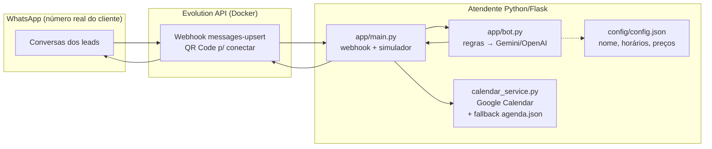

# Arquitetura

## Fluxo de uma mensagem
1. Lead manda "quanto custa o plano familiar?" no WhatsApp comercial.
2. Evolution API dispara `POST /webhook/evolution` no bot.
3. `bot.py` detecta a intenção (`preco_plano`); sem chave de IA responde por regras, com chave usa Gemini/OpenAI com o contexto do `config.json` + agenda.
4. Se for agendamento ("Ana, amanhã 15h"), salva no Google Calendar (ou `agenda.json`) e confirma com data/hora.
5. Resposta volta pela Evolution API ao WhatsApp. Histórico por número mantém o contexto.

## Por que assim?
- **Evolution API em vez de bot dentro do celular:** número real, multi-sessão, sem automação frágil de tela.
- **Regras antes da IA:** funciona grátis do dia 1; IA entra como upgrade, não como dependência.
- **Fallback de agenda:** sem `credentials.json` nada quebra — o agendamento continua registrado em arquivo.
